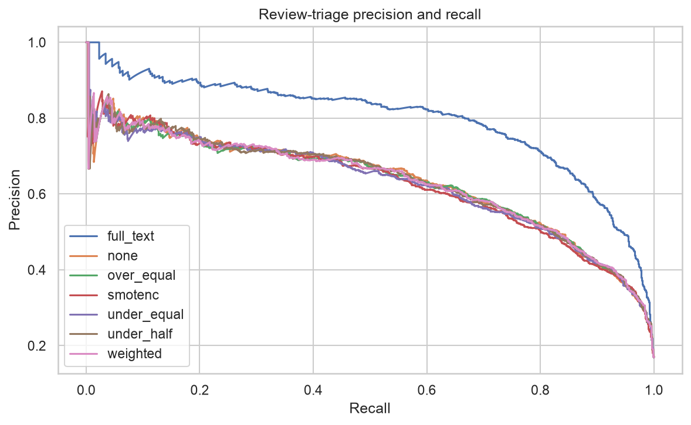

# CartGuard | Retail Review Triage

[](https://github.com/Pariamazaheri/cartguard-review-triage/actions/workflows/ci.yml)

CartGuard builds reproducible review triage pipelines for apparel retail. It predicts **non-recommendation**, a proxy for dissatisfied customers, from review text, age and product categories. Product-separated evaluation, missing-data stress tests and leakage-safe resampling make model decisions reviewable before operational adoption.

The strongest validation-selected pipeline achieved **0.795 test average precision**, **82.6% recall** and **68.4% precision** at a validation-selected threshold of 0.29. These are benchmark results, not measured revenue or customer-service savings.



## Methodology

1. Validate the source with reusable Pandas `.pipe` stages; remove 845 empty reviews and eight duplicate records, retaining 22,633 reviews.
2. Separate products across training (14,158), validation (2,762) and test (5,713) reviews. Run three-fold product-group cross-validation inside training only.
3. Compare random undersampling at two ratios, random oversampling, SMOTENC and balanced class weights against an unbalanced reference. Resampling occurs only inside fitted training pipelines.
4. Compare mean, median, KNN and iterative numeric imputation under a reproducible 20% MCAR stress simulation. Source numeric fields have no missing values; category missingness is preserved.
5. Fit an additional full-text TF–IDF reference, choose each scenario's winner by validation average precision and choose F1 thresholds on validation. Freeze those choices before test scoring.
6. Serialize the entire selected preprocessing/classification pipeline and verify identical probabilities after reload.

## Findings

| Pipeline | Test average precision | Test log loss |
|---|---:|---:|
| Full-text TF–IDF reference | 0.795 | 0.221 |
| Compressed text, no resampling | 0.636 | 0.282 |
| Compressed text, SMOTENC | 0.627 | 0.374 |
| Compressed text, balanced weights | 0.632 | 0.415 |

Preserving lexical information mattered more than balancing classes in this experiment. The resampling comparison holds the compressed representation fixed; the full-text reference changes representation and is not evidence that resampling caused the difference. Equalizing class counts worsened log loss and shifted decision thresholds. Iterative imputation won the missingness scenario with AP 0.631, but all four imputers were close (0.626–0.631).

The label is a recommendation decision, not a verified complaint. English-language reviews, a single retail corpus and MCAR simulation limit transfer to live workflows. Human review, cost-based threshold selection and monitoring remain necessary before real deployment.

## Installation and usage

Use Python 3.11 or 3.12 from the repository root. Training downloads public Kaggle archives; retain source attribution and allow network access. Checkpoints and raw downloads are excluded from Git.

```bash
git clone https://github.com/Pariamazaheri/cartguard-review-triage.git
cd cartguard-review-triage
python -m venv .venv
source .venv/bin/activate
python -m pip install --upgrade pip
python -m pip install '.[dev]'
cartguard run
cartguard predict --input data/example_reviews.csv --output reports/example_predictions.csv
```

Explore [`notebooks/review_resilience.ipynb`](notebooks/review_resilience.ipynb) for an executed, offline walkthrough of committed evidence. To reproduce the walkthrough and verify results:

```bash
python scripts/execute_notebook.py
python scripts/validate_results.py
pytest -q
ruff check .
ruff format --check .
python -m build --wheel
```

## Project structure

| Path | Purpose |
|---|---|
| `src/cartguard/` | Reusable data, modeling, evaluation and command-line code |
| `data/` | Source provenance, attribution and input contracts |
| `notebooks/` | Executed analysis of published artifacts |
| `reports/` | Metrics, audit arrays, manifests and actual figures |
| `docs/` | Design decisions and analytical limitations |
| `scripts/` | Notebook execution and independent result checks |
| `tests/` | Focused numerical, leakage and inference contract tests |
| `.github/workflows/` | Python 3.11/3.12 lint, tests, evidence audit and wheel build |

## Reproducibility and scope

Random seeds, source-file hashes, package versions and run configuration are retained in `reports/run_metadata.json`. `requirements-lock.txt` records the local direct dependency versions; `pyproject.toml` provides compatible installation ranges. CPU timings reflect one local machine and are not infrastructure benchmarks. CI audits saved numerical evidence without retraining or downloading raw data.

This is an independent portfolio research implementation. Production-facing interfaces, packaging and CI make it maintainable; real operational use still requires representative data, monitoring and deployment-specific validation. No employment, commercial adoption or business impact is implied.

See [data provenance](data/README.md), [technical design](docs/methodology.md) and the [MIT code license](LICENSE). Dataset and upstream model rights remain with their respective authors.
